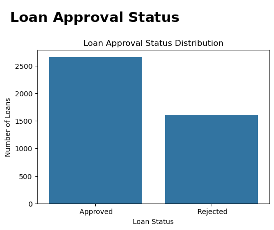
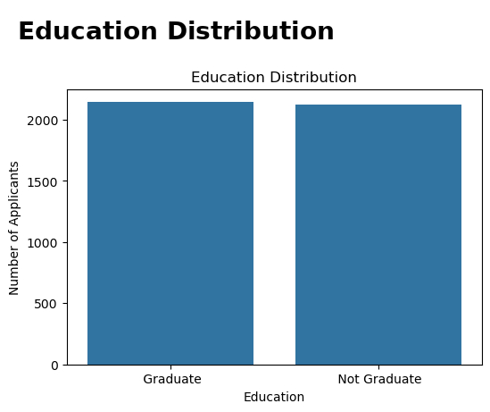
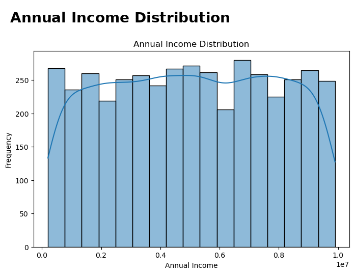
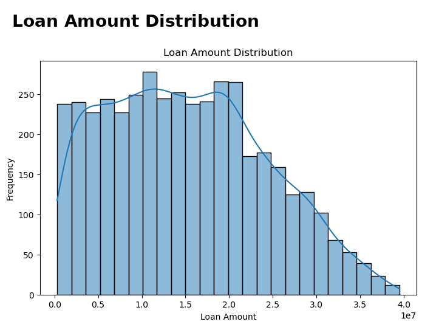
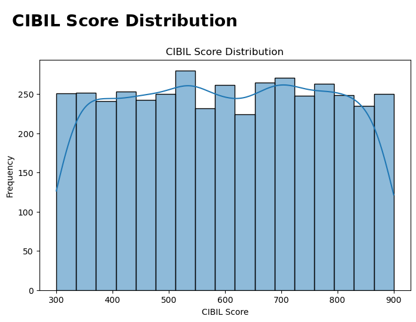
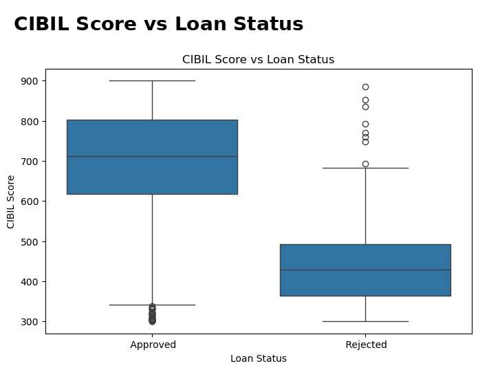
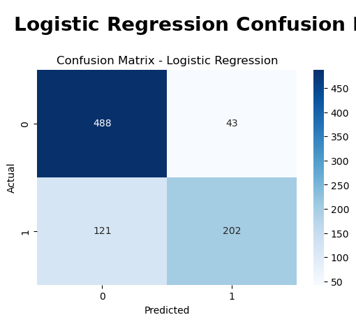
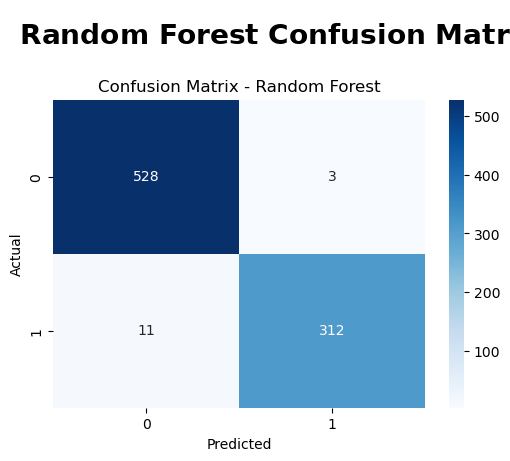
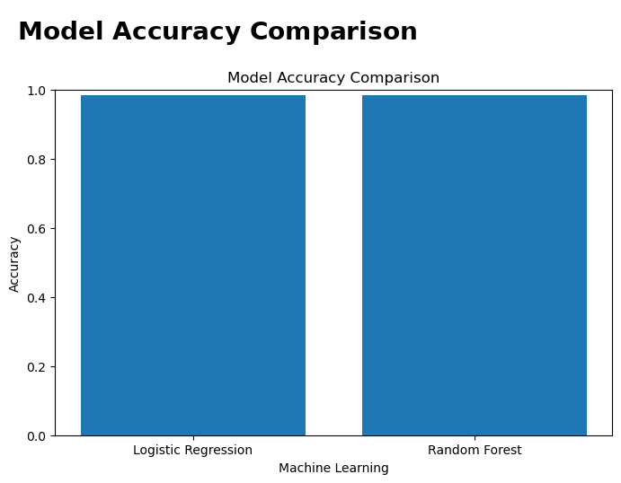
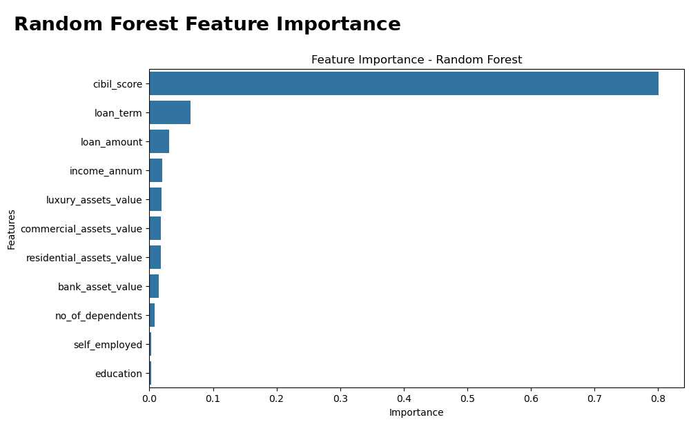

# 💳 Loan Approval Prediction

## 📌 Project Overview

This project focuses on predicting loan approval decisions using Machine Learning. The analysis includes data understanding, data cleaning, exploratory data analysis, feature engineering, model training, and model evaluation.

## 🎯 Objectives

- Analyze factors affecting loan approval
- Perform data cleaning and preprocessing
- Explore relationships between applicant features and loan approval
- Build classification models for loan approval prediction
- Compare model performance using evaluation metrics
- Identify important features influencing predictions

## 🛠️ Technologies Used

- **Programming:** Python
- **Libraries:** Pandas, NumPy, Matplotlib, Seaborn
- **Machine Learning:** Scikit-learn
- **Models:** Logistic Regression, Random Forest
- **Techniques:** EDA, Data Preprocessing, Feature Engineering, Classification
- **Evaluation:** Accuracy, Confusion Matrix, Feature Importance
- **Environment:** Jupyter Notebook

## 🔍 Project Workflow

1. Data Loading
2. Data Understanding
3. Data Cleaning
4. Exploratory Data Analysis
5. Feature Engineering
6. Train-Test Split
7. Model Training
8. Model Comparison
9. Feature Importance Analysis
10. Model Evaluation

## 🤖 Machine Learning Models

Two classification models were evaluated:

- Logistic Regression
- Random Forest Classifier

The Random Forest model achieved an accuracy of approximately **98.36%** on the evaluated test data.

## 📊 Model Performance

| Model | Accuracy |
|---|---:|
| Logistic Regression | 80.80% |
| Random Forest | 98.36% |

## 🔍 Key Findings

- Random Forest achieved **98.36% accuracy**, outperforming Logistic Regression at **80.80%**.
- **CIBIL Score** was the most influential feature in the Random Forest model, contributing approximately **80.1%** of feature importance.
- Exploratory analysis shows that applicant financial characteristics play an important role in loan approval outcomes.
- The project demonstrates the use of **EDA, feature engineering, classification models, and model evaluation** for loan approval prediction.

  ## 🤖 Model Interpretation

The Random Forest model performed better than Logistic Regression on the test dataset. Its higher accuracy indicates that it captured non-linear relationships between applicant features and loan approval outcomes more effectively.

The feature importance analysis shows that **CIBIL Score** is the dominant predictive feature in the Random Forest model, highlighting its strong relationship with loan approval decisions in this dataset.

## ⭐ Feature Importance

Feature importance analysis showed that **CIBIL Score** was the most influential feature in the Random Forest model, with approximately **80.1% feature importance** in the notebook results.

## 📈 Evaluation Metrics

The models were evaluated using classification metrics including:

- Accuracy
- Precision
- Recall
- F1-Score
- Confusion Matrix

## 💡 Key Skills Demonstrated

- Data Cleaning
- Exploratory Data Analysis
- Feature Engineering
- Data Visualization
- Classification
- Logistic Regression
- Random Forest
- Feature Importance
- Model Evaluation
- Python Programming
- Machine Learning

## 📊 Project Visualizations

### Loan Approval Status

### Education Distribution

### Annual Income Distribution

### Loan Amount Distribution

### CIBIL Score Distribution

### CIBIL Score vs Loan Status

### Logistic Regression Confusion Matrix

### Random Forest Confusion Matrix

### Model Accuracy Comparison

### Random Forest Feature Importance

👩‍💻 Author

Shabeena Bano

GitHub: https://github.com/shabeenabano

LinkedIn: https://www.linkedin.com/in/shabeena-bano-49861542b/
